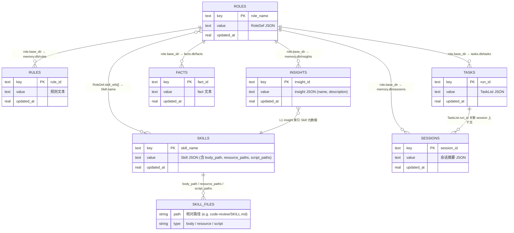

# 数据模型架构

> 本文档集中定义 A2 框架中所有核心数据模型（Pydantic BaseModel）及其存储位置。

---

## 一、RoleDef — 角色定义

```python
class RoleDef(BaseModel):
    name: str
    system_prompt: str                     # 完整的角色系统提示词（支持 {variable} 模板）
    tools: list[str] = ['*']              # 工具白名单，'*' 表示全部
    model: str | None = None              # LLM 模型，None = 使用 LiteLLMProvider.default_model
    max_turns: int = 50
    can_spawn: bool = False               # 是否允许 spawn 子 agent
    use_planning: bool = False
    use_reflexion: bool = False
    env: str = 'env.local'                # 绑定的执行环境（运行时有且一个实例）
    skill_refs: list[str] = ['*']         # 可见技能子集
    memory_namespace: str | None = None   # 默认 = name
    service_specs: list[ServiceSpec] | None = None  # None = ROLE_DEFAULT

    @property
    def effective_namespace(self) -> str: return self.memory_namespace or self.name
    @property
    def base_dir(self) -> str: return f'.agent/roles/{self.effective_namespace}'
```

> `system_prompt` 是角色的完整系统提示词。不存在全局 `DEFAULT_SYSTEM_PROMPT` — 系统提示词完全由角色定义管理。权限配置不在 RoleDef 中，而是由 EnvService 的 PermissionProtocol 统一管理。

**存储**：`AgentService.protocol` → `.agent/roles.db` / `roles` 表 (KV: name → JSON)

---

## 二、ServiceSpec — 服务实例声明

```python
class ServiceSpec(BaseModel):
    key: str          # l0, l1, l4, facts, tasks
    module: str       # 服务类全限定路径
    db: str           # DB 文件名（放在 role base_dir 下）
    table: str        # 表名
    load_on_start: bool = False
    flush_threshold: int = 100
```

**用途**：ContextService 和 PlannerService 根据 ServiceSpec 动态创建 owned memory AppService 实例。

**存储**：`config.py` `ROLE_DEFAULT`（默认）/ `RoleDef.service_specs`（角色自定义）

---

## 三、Task / TaskList — 任务模型

```python
class Task(BaseModel):
    id: str
    run_id: str = ''
    role: str = ''
    content: str = ""
    status: Literal["pending", "in_progress", "done", "failed"] = "pending"
    result: str | None = None
    context: str = ""
    parent_run_id: str | None = None   # orchestrator 关联子任务

    def with_reflection(self, reflection: str) -> "Task":
        return self.model_copy(update={'status': 'pending',
            'context': f"{self.context}\n[Reflection]: {reflection}".strip()})

class TaskList(BaseModel):
    run_id: str
    goal: str = ""
    tasks: list[Task] = []

    def pending(self) -> list[Task]: return [t for t in self.tasks if t.status == "pending"]
    def render_progress(self) -> str: ...
```

**存储**：
- `persist_tasks=True`（默认）→ `{role.base_dir}/tasks.db` / `tasks` 表 (KV: run_id → JSON)
- `persist_tasks=False` → session 缓存，run 结束释放

---

## 四、Skill — 技能模型（配置化 + 文件引用）

Skill 是**配置化实体**，元数据存关系型 DB（可查询、可索引），长文本正文和附属资源通过文件路径引用。

```python
class Skill(BaseModel):
    name: str                                # 唯一标识，同时是文件目录名
    description: str
    tags: list[str] = []
    trigger_keywords: list[str] = []
    always: bool = False                     # 始终加载到 system prompt
    body_path: str = ''                      # 正文文件引用，相对于 skills_dir（如 "code-review/SKILL.md"）
    resource_paths: dict[str, str] = {}      # 附属资源文件引用 {"readme": "code-review/README.md"}
    script_paths: dict[str, str] = {}        # 可执行脚本引用 {"setup": "code-review/setup.sh"}
    usage_count: int = 0
    success_count: int = 0
```

**存储方案**：双层 — DB 索引 + 文件系统

| 层 | 存储位置 | 内容 | 用途 |
|----|---------|------|------|
| 元数据 | `skills.db` / `skills` 表 | name, description, tags, trigger_keywords, always, body_path, resource_paths, script_paths, usage_count, success_count | 检索、匹配、索引构建 |
| 正文/资源 | `.agent/skills/{name}/` 目录 | SKILL.md（正文）、附属文档、可执行脚本 | 按需加载到 LLM 上下文 |

**Protocol**：`SkillService.protocol` → CacheLayer → SQLiteProtocol(path='.agent/skills.db', table='skills')

**文件布局**：

```
.agent/skills/
├── code-review/
│   ├── SKILL.md              ← body_path = "code-review/SKILL.md"
│   ├── checklist.md          ← resource_paths = {"checklist": "code-review/checklist.md"}
│   └── lint.sh               ← script_paths = {"lint": "code-review/lint.sh"}
├── git-workflow/
│   ├── SKILL.md
│   └── hooks/
│       └── pre-commit.sh
└── ...
```

> **设计意图**：Skill 元数据（名称、标签、关键词）是高频查询数据，适合关系型索引；正文和脚本是低频大体积数据，适合文件系统存放。结晶时写入 DB 记录 + 创建文件目录，加载时先查 DB 匹配再按需读文件。

---

## 五、PermissionRule / PermissionConfig — 权限数据模型

权限由 EnvService 的复合协议内层 `PermissionProtocol` 管理。

```python
class PermissionRule(BaseModel):
    pattern: str                  # 工具名通配符，如 'bash', 'read_*', '*'
    action: Literal['allow', 'block', 'approve'] = 'allow'

class PermissionConfig(BaseModel):
    rules: list[PermissionRule] = [
        PermissionRule(pattern='read_file', action='allow'),
        PermissionRule(pattern='list_dir', action='allow'),
        PermissionRule(pattern='grep_search', action='allow'),
        PermissionRule(pattern='*', action='allow'),           # 默认允许
    ]

    def check(self, tool_name: str) -> str:
        for rule in self.rules:
            if fnmatch(tool_name, rule.pattern): return rule.action
        return 'block'
```

**存储**：`PermissionProtocol` 在 EnvService 的复合协议内层管理，配置从 `config.py` 或 `agent.toml` 注入。TerminalProtocol 执行命令前通过内层 `self.protocol.check(tool_name)` 校验权限。

---

## 六、ToolCommand 元数据（ClassVar）

```python
class ToolCommand(BaseCommand, abstract=True):
    tool_name: ClassVar[str]           # LLM 看到的工具名
    description: ClassVar[str]         # 工具描述
    parameters: ClassVar[dict]         # JSON Schema 参数定义
    is_destructive: ClassVar[bool] = False
    required_model: ClassVar[list[str]] = []   # 空 = 任意模型
```

**存储**：代码中 ClassVar，非持久化。运行时通过 `to_schema()` 生成 LLM tools 描述。

---

## 七、全局数据表清单

所有 Memory/Config 数据统一使用 bollydog `SQLiteProtocol` 的 KV 表结构：

```sql
CREATE TABLE IF NOT EXISTS {table_name} (
    key   TEXT PRIMARY KEY,
    value TEXT NOT NULL,         -- JSON 序列化
    updated_at REAL NOT NULL
);
```

### 全局表（进程级单例）

| DB 文件 | 表名 | 所属 Service | key | value | 说明 |
|--------|------|-------------|-----|-------|------|
| `.agent/roles.db` | `roles` | AgentService | role_name | RoleDef JSON | 角色定义仓库 |
| `.agent/skills.db` | `skills` | SkillService | skill_name | Skill JSON（含文件路径引用） | 技能元数据索引 |

### 角色级表（per-role 隔离，路径前缀 `.agent/roles/{namespace}/`）

| DB 文件 | 表名 | 所属 Service | key | value | 说明 |
|--------|------|-------------|-----|-------|------|
| `memory.db` | `rules` | ContextService._l0 | rule_id | 规则文本 | L0 系统规则 |
| `memory.db` | `insights` | ContextService._l1 | insight_id | insight JSON | L1 技能洞察索引 |
| `memory.db` | `sessions` | ContextService._l4 | session_id | 会话摘要 JSON | L4 会话归档 |
| `facts.db` | `facts` | ContextService._facts | fact_id | fact 文本 | L2 全局事实（+BM25） |
| `tasks.db` | `tasks` | PlannerService | run_id | TaskList JSON | 任务计划持久化 |

---

## 八、ER 图 — 表间关系与模块归属



### 关系说明

| 关系 | 类型 | 说明 |
|------|------|------|
| ROLES → RULES/INSIGHTS/SESSIONS | 1:N（物理隔离） | 每个 role 拥有独立 `memory.db`，表通过 `role.base_dir` 路径隔离 |
| ROLES → FACTS | 1:N（物理隔离） | 每个 role 独立 `facts.db`，BM25 索引随 DB 独立 |
| ROLES → TASKS | 1:N（物理隔离） | 每个 role 独立 `tasks.db`，PlannerService 按 `base_dir` 定位 |
| ROLES ↔ SKILLS | M:N（逻辑引用） | `RoleDef.skill_refs[]` 引用 `Skill.name`，`'*'` 表示全部可见 |
| SKILLS → SKILL_FILES | 1:N（文件引用） | Skill 元数据存 DB，正文/资源/脚本通过路径引用文件系统 |
| INSIGHTS → SKILLS | N:1（逻辑映射） | L1 insight 索引条目对应 Skill 元数据，`NotifyIndexUpdateCommand` 同步 |
| TASKS → SESSIONS | 逻辑关联 | `TaskList.run_id` 与 session `trace_id` 对应，同一执行上下文 |

### 模块 × 表 归属矩阵

| 模块/Service | 读 | 写 | 表 |
|-------------|:--:|:--:|------|
| **AgentService** | ✓ | ✓ | ROLES |
| **SkillService** | ✓ | ✓ | SKILLS, SKILL_FILES |
| **ContextService._l0** | ✓ | ✓ | RULES |
| **ContextService._l1** | ✓ | ✓ | INSIGHTS |
| **ContextService._l4** | ✓ | ✓ | SESSIONS |
| **ContextService._facts** | ✓ | ✓ | FACTS |
| **PlannerService** | ✓ | ✓ | TASKS |
| **AgentCommand** | ✓ | — | ROLES（读角色定义）、SKILLS（通过 SkillService） |
| **ReActStepCommand** | ✓ | — | FACTS（通过 build_messages）、INSIGHTS（通过 L1） |
| **CrystallizeSkillCommand** | — | ✓ | SKILLS, SKILL_FILES, INSIGHTS |

---

## 九、存储物理布局

```
.agent/
├── roles.db                     ← AgentService.protocol (全局)
├── skills.db                    ← SkillService.protocol (全局)
├── roles/
│   ├── default/                 ← role "default" 的物理隔离目录
│   │   ├── memory.db            ← rules + insights + sessions (同库多表)
│   │   ├── facts.db             ← facts + BM25 索引
│   │   ├── tasks.db             ← PlannerService 持久化
│   │   └── outputs/             ← Artifact 产物
│   ├── explorer/
│   │   └── ...
│   └── devops/
│       └── ...
└── skills/                      ← Skill 文件系统 (全局共享)
    ├── code-review/
    │   ├── SKILL.md             ← 正文
    │   ├── checklist.md         ← 附属资源
    │   └── lint.sh              ← 可执行脚本
    ├── git-workflow/
    │   └── SKILL.md
    └── ...
```

**隔离策略**：角色级物理隔离（独立 DB 目录），无需 namespace 前缀。技能文件全局共享，通过 `RoleDef.skill_refs` 控制可见性。跨角色分析 → v2 DuckDB ATTACH。
