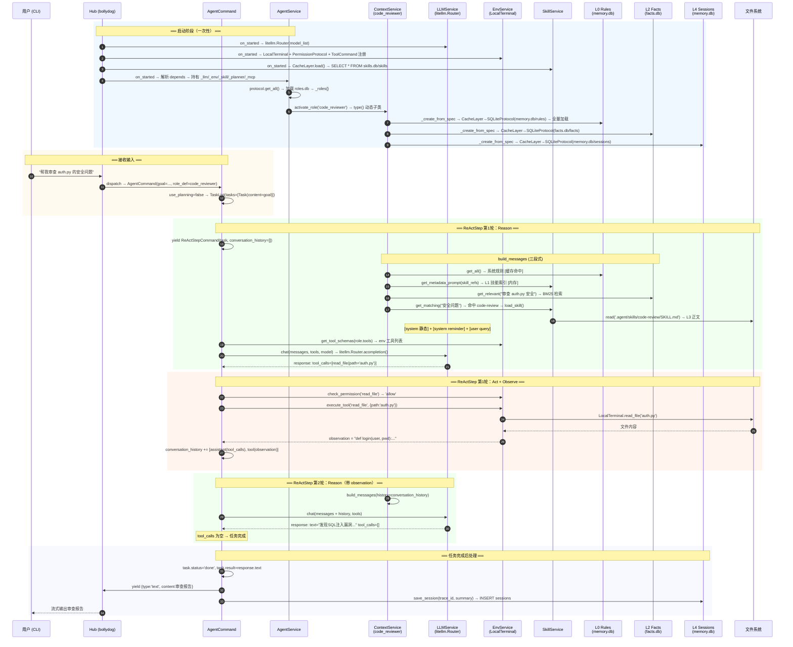

# A2 端到端执行追踪

> 本文档用一个具体场景，把系统从入口到输出的每一步走一遍。
> 目标：读完后能在脑子里完整复现执行路径，知道每一步在哪个类、哪个方法、哪个 DB。
>
> **场景**：用户通过 CLI 输入 "帮我审查 auth.py 的安全问题"，
> Agent 使用 `code_reviewer` 角色，读取文件，调用 LLM，返回审查报告。

---

## 第一步：启动阶段（进程启动，只执行一次）

```
python -m a2 chat --role code_reviewer
```

### 1.1 配置加载

```python
# a2/config.py
merged_config = build_config(toml_path="agent.toml")
# 做了什么：
# 1. 收集各模块 config.py 的默认值
# 2. 读取 agent.toml 覆盖
# 3. 替换 ${ENV_VAR} 环境变量
# 结果：一个完整的 dict，包含所有服务的配置参数
```

### 1.2 服务实例化（bollydog load_a2_config）

按 DAG 拓扑顺序启动，先叶子后根：

```
① LLMService.on_started()
   → litellm.Router(model_list=[...]) 实例化
   → 存入 self.adapter（通过 LiteLLMProvider Protocol）
   → _apps['llm.LLMService'] = self

② EnvService.on_started()  （domain=env, alias=local）
   → LocalTerminal 实例化（subprocess 执行器）
   → PermissionProtocol 加载权限规则（从 config 或 agent.toml）
   → ToolCommand 注册：read_file, write_file, bash, grep, ls...
   → _apps['env.local'] = self

③ SkillService.on_started()
   → CacheLayer → SQLiteProtocol('.agent/skills.db', table='skills') 初始化
   → 预热内存缓存：SELECT * FROM skills → 加载所有 Skill 元数据
   → _apps['skills.SkillService'] = self

④ PlannerService.on_started()
   → 无 Protocol，无 DB 操作
   → depends: [llm.LLMService] 解析，self._llm = LLMService 实例
   → _apps['planner.PlannerService'] = self

⑤ MCPService.on_started()
   → 读取 agent.toml 的 [mcp] 配置
   → 对每个 MCP server：await server_protocol.on_start()
      → mcp.ClientSession 初始化（stdio/SSE）
      → await session.initialize()
   → 注册 MCPToolWrapper 到 EnvService（或 AgentService）
   → _apps['mcp.MCPService'] = self

⑥ AgentService.on_started()
   → 解析 depends，持有上面所有 Service 的引用：
      self._llm    = _apps['llm.LLMService']
      self._env    = _apps['env.local']
      self._skill  = _apps['skills.SkillService']
      self._planner = _apps['planner.PlannerService']
      self._mcp    = _apps['mcp.MCPService']
   → 初始化角色仓库 Protocol：
      CacheLayer → SQLiteProtocol('.agent/roles.db', table='roles')
   → self._active_contexts = {}   ← 空字典，按需创建
   → _apps['agent.AgentService'] = self
```

### 1.3 角色激活（activate_role）

```python
# AgentService.activate_role('code_reviewer')
# 在 on_started 时激活默认角色，或用户请求时动态激活

async def activate_role(self, role_name: str):
    # 1. 从 DB 读取 RoleDef
    role_def = await self.protocol.get(role_name)
    # → SELECT value FROM roles WHERE key='code_reviewer'
    # → 反序列化为 RoleDef Pydantic 对象

    # 2. 确定命名空间
    ns = role_def.effective_namespace   # 'code_reviewer'

    # 3. 如果已有激活的 context，跳过
    if ns in self._active_contexts:
        return

    # 4. 动态创建 ContextService 实例
    context_svc = await self._create_context_service(role_def)

    # 5. 存入 active_contexts
    self._active_contexts[ns] = context_svc
```

```python
# AgentService._create_context_service(role_def)
# 这是"动态子类"机制的实际做法

async def _create_context_service(self, role_def: RoleDef):
    base_dir = role_def.base_dir   # '.agent/roles/code_reviewer'
    specs = role_def.service_specs or ROLE_DEFAULT  # 用默认 ServiceSpec

    # 为这个角色创建一个 ContextService 实例
    ctx_svc = ContextService(
        role_def=role_def,
        llm=self._llm,
        skill=self._skill,
    )

    # ContextService 内部按 specs 创建 owned memory services
    # specs 示例（来自 ROLE_DEFAULT）：
    # [
    #   ServiceSpec(key='l0', db='memory.db', table='rules', load_on_start=True),
    #   ServiceSpec(key='l1', db='memory.db', table='insights', load_on_start=True),
    #   ServiceSpec(key='l4', db='memory.db', table='sessions'),
    #   ServiceSpec(key='facts', db='facts.db', table='facts'),
    # ]
    await ctx_svc.on_started(base_dir, specs)
    # 内部做：
    # self._l0 = MemoryLayerService(db=base_dir/memory.db, table=rules)
    # self._l1 = MemoryLayerService(db=base_dir/memory.db, table=insights)
    # self._l4 = MemoryLayerService(db=base_dir/memory.db, table=sessions)
    # self._facts = GlobalFactsService(db=base_dir/facts.db, table=facts)
    # 对 load_on_start=True 的层：await layer.load()
    # → SELECT * FROM rules WHERE ... → 加载到内存缓存

    return ctx_svc
```

**启动后的内存状态：**
```
AgentService
├── _llm      → LLMService（litellm.Router）
├── _env      → EnvService（LocalTerminal + PermissionProtocol）
├── _skill    → SkillService（内存缓存了所有 Skill 元数据）
├── _planner  → PlannerService
├── _mcp      → MCPService
└── _active_contexts = {
      'code_reviewer': ContextService(
          _l0:    MemoryLayerService → memory.db/rules     [已加载到内存]
          _l1:    MemoryLayerService → memory.db/insights  [已加载到内存]
          _l4:    MemoryLayerService → memory.db/sessions  [按需加载]
          _facts: GlobalFactsService → facts.db/facts      [按需检索]
      )
    }
```

---

## 第二步：接收用户输入

```
用户输入：帮我审查 auth.py 的安全问题
```

### 2.1 CLI 入口

```python
# a2/cli.py（bollydog fire CLI）
# 用户输入 → Message 构造 → Hub.dispatch

message = Message(
    destination='agent.AgentService',
    trace_id=uuid4(),
    payload={'goal': '帮我审查 auth.py 的安全问题', 'role': 'code_reviewer'}
)
await hub.dispatch(message)
```

### 2.2 Hub 路由

```python
# bollydog Hub._execute(message)
# 根据 destination 找到 AgentService
# 找到注册的 AgentCommand 类
# 实例化：AgentCommand(goal=..., role=...)
# 调用 _run_gen(command) 因为 AgentCommand.__call__ 是 async generator
```

---

## 第三步：AgentCommand 执行（Agent Loop）

```python
# a2/agent/command.py
class AgentCommand(BaseCommand):
    goal: str
    role: str = 'default'

    async def __call__(self):
        svc = app  # globals.app → AgentService

        # 1. 获取 RoleDef
        role_def = await svc.protocol.get(self.role)
        # → 从 .agent/roles.db / roles 表读取 code_reviewer 的 RoleDef

        # 2. 获取 ContextService（已在 activate_role 时创建）
        ns = role_def.effective_namespace   # 'code_reviewer'
        role_ctx = svc._active_contexts[ns]

        # 3. 可选：生成任务计划
        if role_def.use_planning:
            task_list = yield PlanCommand(goal=self.goal, role_def=role_def)
            # → PlanCommand 调用 LLM，生成 TaskList
            # → 写入 .agent/roles/code_reviewer/tasks.db
        else:
            task_list = TaskList(run_id=str(uuid4()), goal=self.goal,
                                 tasks=[Task(content=self.goal)])

        # 4. 主循环
        for task in task_list.pending():
            if role_def.use_reflexion:
                result = yield ReflexionCommand(task=task, role_def=role_def)
            else:
                result = yield ReActStepCommand(task=task, role_def=role_def)

            yield {'type': 'progress', 'task_id': task.id, 'done': result.success}

        yield {'type': 'done'}
```

---

## 第四步：ReActStepCommand（核心执行单元）

```python
# a2/planner/commands.py
class ReActStepCommand(BaseCommand):
    task: Task
    role_def: RoleDef

    async def __call__(self):
        svc = app   # AgentService
        ns = self.role_def.effective_namespace
        role_ctx = svc._active_contexts[ns]
        history = []   # 本次 ReAct 的工具调用历史（session 内，不持久化）

        for step in range(self.role_def.max_turns):

            # ── Reason ──────────────────────────────────────────

            # 4.1 组装 messages（核心：三段式 System Prompt）
            messages = await role_ctx.build_messages(
                role_def=self.role_def,
                query=self.task.content,
                history=history,
            )
            # build_messages 内部做了什么 → 见第五步详述

            # 4.2 聚合工具描述
            tools = svc._env.get_tool_schemas(self.role_def.tools)
            tools += svc.get_agent_tool_schemas()          # spawn_agent, ask_user...
            tools += svc._mcp.get_tool_schemas() if svc._mcp else []

            # 4.3 调用 LLM
            response = await svc._llm.chat(
                messages=messages,
                tools=tools,
                model=self.role_def.model,   # None = 用默认模型
            )
            # → litellm.Router.acompletion(model=..., messages=..., tools=...)
            # → 返回 OpenAI 格式的 response

            yield {'type': 'text', 'content': response.text}  # 流式输出文字

            # ── Act ─────────────────────────────────────────────

            # 4.4 无工具调用 → 任务完成
            if not response.tool_calls:
                task.status = 'done'
                task.result = response.text
                return TaskResult(success=True, output=response.text)

            # 4.5 执行工具调用
            for tool_call in response.tool_calls:
                observation = yield ToolCallCommand(
                    tool_name=tool_call.name,
                    arguments=tool_call.arguments,
                    role_def=self.role_def,
                )
                # → ToolCallCommand 内部见第六步

                # ── Observe ─────────────────────────────────────
                history.append({
                    'role': 'assistant',
                    'content': None,
                    'tool_calls': [tool_call],
                })
                history.append({
                    'role': 'tool',
                    'tool_call_id': tool_call.id,
                    'content': observation,
                })

                yield {'type': 'tool_result', 'tool': tool_call.name,
                       'result': observation[:500]}  # 流式输出工具结果预览

        # 超过 max_turns
        return TaskResult(success=False, output='exceeded max_turns')
```

---

## 第五步：build_messages（三段式 System Prompt 组装）

```python
# a2/context/service.py
class ContextService:
    async def build_messages(self, role_def, query, history) -> list[dict]:

        # ── 静态核心（每次都有，不变）──────────────────────────────

        # L0: 系统规则
        rules = await self._l0.get_all()
        # → SELECT value FROM .agent/roles/code_reviewer/memory.db/rules
        # → 已在 on_start 时加载到内存，这里走缓存

        # 角色身份（RoleDef.system_prompt）
        role_prompt = role_def.system_prompt
        # "你是代码审查员，专注于发现安全漏洞和性能问题..."

        # L1: 技能元数据（始终包含，让 LLM 知道有哪些技能可用）
        skill_metadata = svc._skill.get_metadata_prompt(role_def.skill_refs)
        # → 从内存缓存读取，过滤 skill_refs
        # 格式：
        # [可用技能]
        # - code-review: 代码安全审查工作流 (keywords: security, vulnerability, review)
        # - git-workflow: Git 提交规范 (keywords: commit, branch, merge)

        # L2: 全局事实检索（BM25 语义相关）
        facts = await self._facts.get_relevant(query, top_k=5)
        # → bm25s.search(query) on .agent/roles/code_reviewer/facts.db
        # 返回与"安全审查 auth.py"最相关的 5 条事实

        static_system = "\n\n".join(filter(None, [
            "\n".join(rules),    # L0
            role_prompt,          # 角色身份
            skill_metadata,       # L1 技能元数据
            "\n".join(facts),     # L2 事实
        ]))

        # ── System Reminder（动态，按需）──────────────────────────

        # L3: 技能匹配（关键词触发）
        matched_skills = svc._skill.get_matching(query)
        # → 对每个 Skill，检查 query 是否包含 trigger_keywords
        # → "安全问题" 命中 code-review 技能的 ["security", "vulnerability", "review"]

        skill_reminders = []
        for skill in matched_skills:
            body = await _read_skill_body(skill.body_path)
            # → open('.agent/skills/code-review/SKILL.md').read()
            skill_reminders.append({
                'role': 'system',
                'content': f"[技能提示: {skill.name}]\n{body}"
            })

        # ── L4: 会话历史 ──────────────────────────────────────────

        session_history = await self._l4.get_recent(token_budget=8000)
        # → SELECT value FROM sessions ORDER BY updated_at DESC LIMIT N
        # → 直到 token 预算用完

        # ── Token 预算检查 + 压缩 ─────────────────────────────────

        all_messages = (
            [{'role': 'system', 'content': static_system}]
            + skill_reminders        # [system] × N
            + session_history        # [user/assistant/tool] × M
            + history                # 本轮 ReAct 历史
            + [{'role': 'user', 'content': query}]
        )

        token_count = litellm.token_counter(
            model=role_def.model or DEFAULT_MODEL,
            messages=all_messages,
        )

        if token_count > COMPACT_THRESHOLD:
            all_messages = await self._compact(all_messages, role_def)
            # → 见三层压缩逻辑

        return all_messages
```

**此刻 messages[] 的实际内容（本场景）：**
```
[system]   "你是代码审查员，专注于安全漏洞...
            [可用技能] code-review, git-workflow..."

[system]   "[技能提示: code-review]
            ## 代码审查工作流
            1. 先读取文件全文
            2. 识别以下安全模式：SQL注入、XSS、认证绕过...
            ..."

[user]     "帮我审查 auth.py 的安全问题"
```

---

## 第六步：ToolCallCommand（工具执行）

```python
# a2/env/commands.py
class ToolCallCommand(BaseCommand):
    tool_name: str
    arguments: dict
    role_def: RoleDef

    async def __call__(self) -> str:
        svc = app   # AgentService

        # 6.1 权限检查（在 EnvService 层）
        action = svc._env.protocol.check(self.tool_name)
        # → PermissionProtocol.check('read_file')
        # → 遍历 PermissionRule 列表，匹配第一条
        # → 返回 'allow' / 'block' / 'approve'

        if action == 'block':
            return f"[Permission denied: {self.tool_name}]"

        if action == 'approve':
            approved = yield AskUserCommand(
                message=f"Agent 请求执行 {self.tool_name}({self.arguments})，是否允许？"
            )
            if not approved:
                return "[User denied]"

        # 6.2 查找工具类
        tool_cls = svc._env.get_tool(self.tool_name)
        # → 从 EnvService 注册的 ToolCommand 里找 tool_name='read_file'
        # → ReadFileCommand

        # 6.3 执行工具
        tool_instance = tool_cls(**self.arguments)
        result = await tool_instance()
        # → ReadFileCommand.__call__():
        #     content = await protocol.read_file('auth.py')
        #     → globals.protocol → EnvService.TerminalProtocol
        #     → LocalTerminal.read_file('auth.py')
        #     → open('auth.py').read()
        #     return content

        return result   # auth.py 的文件内容，作为 observation 返回给 ReActStepCommand
```

---

## 第七步：LLM 收到工具结果，给出最终回复

ReActStepCommand 把 auth.py 的内容加入 history，再次调用 build_messages，再次调用 LLM：

```
[system]   "你是代码审查员..."
[system]   "[技能提示: code-review] ..."
[user]     "帮我审查 auth.py 的安全问题"
[assistant] tool_calls: [read_file(path='auth.py')]
[tool]     "def login(user, pwd):\n    query = f'SELECT...{user}...{pwd}'..."
```

LLM 分析 auth.py 内容，发现 SQL 注入漏洞，返回无工具调用的文字回复：

```
"发现以下安全问题：
1. SQL 注入漏洞（第3行）：直接拼接用户输入到 SQL 查询...
2. 明文密码对比（第7行）：应使用 bcrypt..."
```

因为 `response.tool_calls` 为空，ReActStepCommand 结束循环，返回 TaskResult。

---

## 第八步：任务完成后处理

```python
# ReActStepCommand 结束后，AgentCommand 可选触发结晶

if should_crystallize(task, history):
    yield CrystallizeSkillCommand(
        task=task,
        history=history,
        role_def=self.role_def,
    )
    # CrystallizeSkillCommand 内部：
    # 1. yield ExtractPatternCommand → LLM 提取执行模式
    # 2. await svc._skill.save_skill(new_skill)
    #    → INSERT INTO .agent/skills.db/skills
    #    → 创建 .agent/skills/new-skill/SKILL.md
    # 3. yield NotifyIndexUpdateCommand
    #    → INSERT INTO .agent/roles/code_reviewer/memory.db/insights

# 流式输出最终结果
yield {'type': 'final', 'content': task.result}

# 写入 L4 会话历史
await role_ctx._l4.save_session(trace_id, summary)
# → INSERT/UPDATE INTO .agent/roles/code_reviewer/memory.db/sessions
```

---

## 完整数据读写清单（本场景）

| 操作 | 时机 | 读/写 | 位置 |
|------|------|-------|------|
| 读 RoleDef | AgentCommand 开始 | 读 | `.agent/roles.db` / `roles` |
| 读 L0 规则 | build_messages | 读（缓存） | `.agent/roles/code_reviewer/memory.db` / `rules` |
| 读 L1 技能索引 | build_messages | 读（缓存） | `.agent/roles/code_reviewer/memory.db` / `insights` |
| 读 Skill 元数据 | build_messages | 读（缓存） | `.agent/skills.db` / `skills` |
| 检索 L2 事实 | build_messages | 读（BM25） | `.agent/roles/code_reviewer/facts.db` / `facts` |
| 读 L3 技能正文 | build_messages（触发时） | 读（文件） | `.agent/skills/code-review/SKILL.md` |
| 读 L4 历史 | build_messages | 读 | `.agent/roles/code_reviewer/memory.db` / `sessions` |
| 读 auth.py | ToolCallCommand | 读（文件系统） | `auth.py`（工作目录） |
| 写新技能（可选） | CrystallizeSkillCommand | 写 | `.agent/skills.db` + 文件 |
| 写 L1 索引（可选） | NotifyIndexUpdateCommand | 写 | `.agent/roles/code_reviewer/memory.db` / `insights` |
| 写 L4 历史 | AgentCommand 结束 | 写 | `.agent/roles/code_reviewer/memory.db` / `sessions` |

---

## 并发多角色场景（补充）

```python
# 用户同时使用 code_reviewer 和 devops 两个角色
svc._active_contexts = {
    'code_reviewer': ContextService(base_dir='.agent/roles/code_reviewer/'),
    'devops': ContextService(base_dir='.agent/roles/devops/'),
}
# 两个 ContextService 实例完全独立，各自拥有独立 DB
# AgentCommand 通过 role_def.effective_namespace 选择对应的 context
# 并发安全：SQLite 单文件，写操作串行；读操作并发安全
```

---

## 设计盲点

> 以下问题已归入 [A1-open-questions.md](A1-open-questions.md)：
> - `_active_contexts` 销毁时机 → C7
> - `build_messages` history 范围 → C6
> - TaskList 持久化时机 → 已在 [06-mod-planner.md](06-mod-planner.md) 明确（PlanCommand 生成后立即写入）
> - Skill 结晶触发条件 → Q7（不自动触发，暴露 Command 接口）

---

## 完整流程图（全局视角）



**图例说明**：
- **蓝色区域**：启动阶段（进程级一次性操作）
- **橙色区域**：接收用户输入 → Hub 路由
- **绿色区域**：ReAct 循环（Reason → LLM 推理）
- **粉色区域**：ReAct 循环（Act → 工具执行 + Observe）
- **紫色区域**：任务完成 → 会话持久化

**调用链汇总**：
| 步骤 | 调用方 | 方法/函数 | 目标 |
|------|--------|----------|------|
| 1-4 | Hub | `on_started()` | 全局单例服务启动 |
| 5 | AgentService | `protocol.get_all()` | roles.db 读取角色仓库 |
| 6-9 | AgentService | `activate_role()` → `_create_from_spec()` | 动态创建 ContextService + owned memory |
| 10-11 | Hub | `dispatch()` → `_run_gen()` | 路由到 AgentCommand |
| 12 | AgentCommand | `TaskList()` | 构建任务（无 planning 时单任务） |
| 13-17 | ContextService | `build_messages()` | L0+L1+L2+L3 组装三段式 prompt |
| 18-19 | ReActStepCommand | `svc._llm.chat()` | LLM 推理 |
| 20-23 | ReActStepCommand | `env.execute_tool()` | 工具执行 |
| 24-27 | ReActStepCommand | 第2轮 `chat()` | LLM 分析 + 生成回复 |
| 28-30 | AgentCommand | `_l4.save_session()` | 写入 L4 会话归档 |
