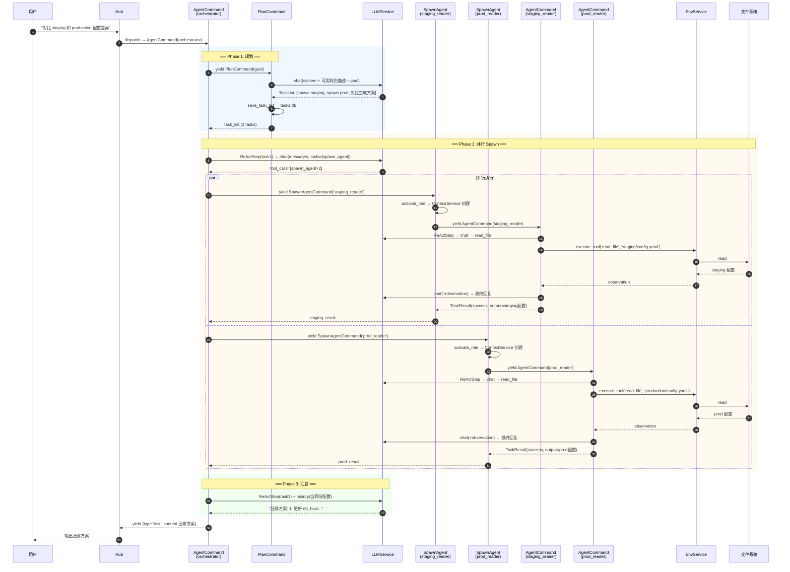

# A2 端到端执行追踪 — T2：多角色编排（Orchestrator + SpawnAgent）

> **场景**：用户通过 CLI 输入 "对比 staging 和 production 的配置差异，生成迁移方案"。
> Orchestrator 角色接收任务，规划后并行 spawn `staging_reader` 和 `prod_reader` 两个子角色收集信息，汇总后输出迁移方案。
>
> **覆盖架构要点**：PlanCommand 生成 TaskList、SpawnAgentCommand 并行 fan-out、子角色激活与隔离、agent_depth 防递归、多角色 ContextService 共存。

---

## 第一步：启动阶段（同 t1，略过细节）

启动后 `_active_contexts` 为空或仅有 default 角色。`roles.db` 中预注册了：

```python
# roles.db 中的角色定义
orchestrator = RoleDef(
    name='orchestrator', system_prompt='你是任务编排者，分析任务并委派给合适的角色...',
    tools=['spawn_agent', 'ask_user', 'create_role'], can_spawn=True,
    use_planning=True, model='anthropic/claude-sonnet-4-20250514',
)
staging_reader = RoleDef(
    name='staging_reader', system_prompt='你负责读取 staging 环境的配置文件...',
    tools=['read_file', 'bash', 'grep_search'], can_spawn=False,
)
prod_reader = RoleDef(
    name='prod_reader', system_prompt='你负责读取 production 环境的配置文件...',
    tools=['read_file', 'bash', 'grep_search'], can_spawn=False,
)
```

---

## 第二步：Orchestrator 接收任务

```python
# CLI → Hub.dispatch → AgentCommand
message = AgentCommand(goal='对比 staging 和 production 的配置差异，生成迁移方案', role_def=orchestrator)
```

### 2.1 角色激活

```python
# AgentService.activate_role('orchestrator')
# → type('orchestrator_ContextService', (ContextService,), ...)
# → 创建 owned memory:
#     .agent/roles/orchestrator/memory.db (rules + insights + sessions)
#     .agent/roles/orchestrator/facts.db (facts)
# → _active_contexts['orchestrator'] = ctx
```

### 2.2 PlanCommand（use_planning=True）

```python
# AgentCommand 检测到 role_def.use_planning=True
task_list = yield PlanCommand(goal=goal, run_id=trace_id)
```

PlanCommand 内部：

```python
class PlanCommand(BaseCommand):
    async def __call__(self):
        svc = app
        messages = [
            {'role': 'system', 'content': '将目标分解为可执行的子任务列表，JSON 格式输出...'},
            {'role': 'user', 'content': self.goal},
        ]
        # 注入可用角色描述，让 LLM 知道能 spawn 谁
        available = svc.get_available_description()
        # "- staging_reader: 你负责读取 staging 环境... 工具=[read_file,bash], 模型=default
        #  - prod_reader: 你负责读取 production 环境... 工具=[read_file,bash], 模型=default"
        messages[0]['content'] += f'\n\n可用角色:\n{available}'

        response = await svc._llm.chat(messages=messages, model=self.role_def.model)
        # LLM 返回 JSON:
        # {"tasks": [
        #   {"id": "1", "content": "spawn staging_reader 读取 staging 配置", "role": "staging_reader"},
        #   {"id": "2", "content": "spawn prod_reader 读取 production 配置", "role": "prod_reader"},
        #   {"id": "3", "content": "对比两份配置，生成迁移方案"}
        # ]}

        task_list = TaskList.model_validate_json(response.text)
        task_list.run_id = self.run_id

        # 持久化到 tasks.db（persist_tasks=True）
        await svc._planner.save_task_list(task_list, self.role_def.base_dir)
        # → INSERT INTO .agent/roles/orchestrator/tasks.db/tasks
        log.info(f'计划生成: {len(task_list.tasks)} 个任务')
        return task_list
```

---

## 第三步：并行 SpawnAgent（Fan-out）

AgentCommand 主循环处理 task_list。任务 1 和 2 可并行：

```python
# AgentCommand.__call__ 中
for task in task_list.pending():
    task_list.update_task(task.id, status="in_progress")

    # orchestrator 的 ReActStepCommand → LLM 看到 spawn_agent 工具
    result = yield ReActStepCommand(task=task, role_ctx=role_ctx, ...)
```

### 3.1 ReActStep → LLM 决定 spawn

```python
# ReActStepCommand 构建工具列表:
tools = svc.get_agent_tool_schemas()  # spawn_agent, ask_user, create_role
# orchestrator 的 env 工具为空（tools=['spawn_agent','ask_user','create_role']）

# LLM 调用，response.tool_calls:
# [spawn_agent(role='staging_reader', input={'task': '读取 staging/config.yaml 全部内容'}),
#  spawn_agent(role='prod_reader', input={'task': '读取 production/config.yaml 全部内容'})]
```

### 3.2 并行 yield SpawnAgentCommand

```python
# ReActStepCommand 检测到两个 spawn_agent 调用 → 并行 yield
[staging_result, prod_result] = yield [
    SpawnAgentCommand(role='staging_reader', input={'task': '读取 staging/config.yaml'}),
    SpawnAgentCommand(role='prod_reader', input={'task': '读取 production/config.yaml'}),
]
# Hub._run_gen 识别 yield list → 并行 dispatch
```

### 3.3 SpawnAgentCommand 内部

```python
class SpawnAgentCommand(BaseCommand):
    async def __call__(self):
        svc = app
        role_def = svc._roles.get(self.role)  # 'staging_reader'

        # 1. 激活角色（幂等）
        if role_def.effective_namespace not in svc._active_contexts:
            await svc.activate_role(self.role)
        # → type('staging_reader_ContextService', (ContextService,), ...)
        # → 创建 .agent/roles/staging_reader/memory.db + facts.db
        # → _active_contexts['staging_reader'] = ctx

        # 2. 检查递归深度
        depth = (await session.get('agent_depth')) or 0  # 当前 = 0
        if depth >= 2: return {"success": False, "error": "Max depth"}

        # 3. 递增深度，yield 子 AgentCommand
        await session.set('agent_depth', depth + 1)  # = 1
        result = yield AgentCommand(
            role_def=role_def, goal=str(self.input.get('task', '')),
            session_namespace=f"staging_reader/{message.trace_id}",
        )
        await session.set('agent_depth', depth)  # 恢复 = 0
        return result
```

---

## 第四步：子 Agent 执行（staging_reader）

子 AgentCommand 执行流程与 t1 相同，但运行在 **staging_reader 的隔离上下文中**：

```python
# 子 AgentCommand 内：
ns = 'staging_reader'
role_ctx = svc._active_contexts[ns]  # staging_reader 的 ContextService

# build_messages 使用 staging_reader 的：
# - L0: .agent/roles/staging_reader/memory.db/rules
# - L2: .agent/roles/staging_reader/facts.db/facts
# - system_prompt: "你负责读取 staging 环境的配置文件..."

# ReActStep → LLM 调用 read_file → EnvService.execute_tool → LocalTerminal
# → read_file('staging/config.yaml') → 返回文件内容

# 任务完成 → TaskResult(success=True, output='staging 配置内容...')
```

**同时**，`prod_reader` 在另一个并行分支中执行相同流程（不同的 ContextService 实例）。

### 此时内存状态

```
AgentService._active_contexts = {
    'orchestrator':    ContextService → .agent/roles/orchestrator/
    'staging_reader':  ContextService → .agent/roles/staging_reader/  ← 新激活
    'prod_reader':     ContextService → .agent/roles/prod_reader/     ← 新激活
}
```

三个角色完全物理隔离（独立 DB 目录），并发安全。

---

## 第五步：Orchestrator 汇总

两个子 agent 都完成后，ReActStepCommand 收到两个结果：

```python
# staging_result = {"success": True, "output": "staging 配置:\ndb_host: staging-db..."}
# prod_result = {"success": True, "output": "production 配置:\ndb_host: prod-db..."}

# 作为 tool observation 追加到 history
history.append({'role': 'tool', 'content': f'staging: {staging_result["output"]}'})
history.append({'role': 'tool', 'content': f'prod: {prod_result["output"]}'})

# 再次调 LLM → orchestrator 的 system_prompt 引导它对比差异
response = await svc._llm.chat(messages + history, model=role_def.model)
# LLM 输出: "配置差异分析:\n1. db_host: staging-db → prod-db\n2. ..."
```

### 5.1 任务 3（对比生成迁移方案）

orchestrator 继续处理 task_list 的第 3 个任务：

```python
# task_list.tasks[2] = Task(content='对比两份配置，生成迁移方案')
# 此时 conversation_history 已包含两个子 agent 的结果
result = yield ReActStepCommand(task=task3, history=conversation_history, ...)
# LLM 直接生成迁移方案（不需要工具调用），返回文字回复
```

---

## 第六步：输出与持久化

```python
# AgentCommand 结束
yield {'type': 'text', 'content': '迁移方案:\n1. 更新 db_host...\n2. ...'}
yield {'type': 'done'}

# 持久化：
# - orchestrator 的 L4 会话归档
await role_ctx._l4.save_session(trace_id, summary)
# → INSERT INTO .agent/roles/orchestrator/memory.db/sessions

# - staging_reader 和 prod_reader 的会话也各自持久化
```

---

## 完整流程图



---

## 数据读写清单

| 操作 | 时机 | 读/写 | 位置 |
|------|------|-------|------|
| 读角色定义 ×3 | activate_role | 读 | `.agent/roles.db` |
| LLM 规划 | PlanCommand | 调用 | litellm.Router |
| 写 TaskList | PlanCommand 后 | 写 | `.agent/roles/orchestrator/tasks.db` |
| 创建 ContextService ×2 | SpawnAgent | 写（DDL） | `.agent/roles/staging_reader/`, `.agent/roles/prod_reader/` |
| 读 staging/config.yaml | 子 agent ToolCall | 读 | 工作目录文件系统 |
| 读 production/config.yaml | 子 agent ToolCall | 读 | 工作目录文件系统 |
| LLM 推理 ×5 | 各 ReActStep | 调用 | litellm.Router（规划1+子agent各2+汇总1） |
| 写 L4 会话 ×3 | 各 AgentCommand 结束 | 写 | 各角色 `memory.db/sessions` |

---

## 本场景覆盖的架构要点

| 要点 | 在本追踪中的体现 |
|------|----------------|
| PlanCommand 生成 TaskList | orchestrator 分解任务为 3 步 |
| SpawnAgentCommand 并行 fan-out | yield [Spawn×2] → Hub 并行 dispatch |
| 动态角色激活 | staging_reader/prod_reader 按需 activate_role |
| 角色物理隔离 | 三个角色各自独立 DB 目录 |
| agent_depth 防递归 | SpawnAgent 检查 depth < 2 |
| can_spawn 权限控制 | 仅 orchestrator 有 spawn_agent 工具 |
| get_available_description() | PlanCommand 注入可用角色描述给 LLM |
| session namespace | 子 agent 使用 `{role}/{trace_id}` 隔离 |
| TaskList 持久化 | PlanCommand 后立即写 tasks.db，支持断点续传 |
