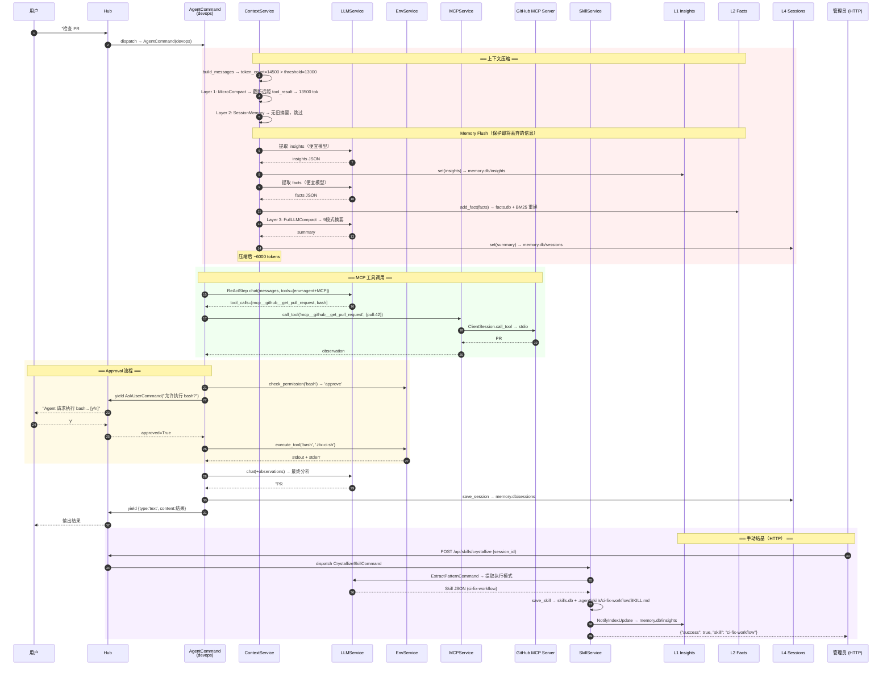

# A2 端到端执行追踪 — T3：上下文压缩 + MCP 工具 + Skill 结晶

> **场景**：用户与 `devops` 角色进行长对话（已超过 compact_threshold），期间调用 MCP GitHub 工具查询 PR，
> 触发三层上下文压缩（MicroCompact → SessionMemory → FullLLMCompact），压缩前执行 Memory Flush。
> 对话结束后，管理员通过 HTTP 接口手动触发技能结晶。
>
> **覆盖架构要点**：MCP 工具发现与执行、三层上下文压缩、Memory Flush（L1 insights + L2 facts）、CrystallizeSkillCommand 手动触发、PermissionProtocol approve 流程。

---

## 前置状态

- devops 角色已激活，已有 15 轮对话历史（约 12000 tokens）
- MCP GitHub server 已连接，提供 `mcp__github__list_pull_requests` 等工具
- `.agent/roles/devops/memory.db` 已有 L0 规则和 L1 insights
- agent.toml 中 `bash` 工具配置为 `action='approve'`

```python
# 当前 conversation_history 状态（简化）
conversation_history = [
    {'role': 'user', 'content': '帮我检查 CI 管道配置'},
    {'role': 'assistant', 'content': '...', 'tool_calls': [read_file('.github/workflows/ci.yml')]},
    {'role': 'tool', 'content': '... 300行 YAML ...'},
    # ... 15 轮对话，包含大量 tool_result ...
    {'role': 'user', 'content': '查看最近的 PR 构建状态'},
]
# total tokens ≈ 12000, compact_threshold = 13000
```

---

## 第一步：新一轮对话输入

```
用户输入：检查 PR #42 的构建失败原因，然后执行修复脚本
```

---

## 第二步：build_messages + 压缩触发

### 2.1 build_messages 组装

```python
# ContextService.build_messages(role_def=devops, query=..., history=conversation_history)

# 三段式组装（同 t1）:
# [system 静态] L0 + system_prompt + L1 技能索引 + L2 事实检索
# [system reminder] L3 匹配技能正文
# history: 15 轮对话 + 新 query
# 工具: env 工具 + agent 工具 + MCP 工具

all_messages = [system_static] + skill_reminders + conversation_history + [user_query]
token_count = await svc._llm.count_tokens(all_messages, model=role_def.model)
# → 约 14500 tokens > compact_threshold(13000)
```

### 2.2 三层压缩

```python
async def compact_if_needed(self, messages, model):
    token_count = await self._llm.count_tokens(messages, model)
    if token_count <= self.compact_threshold: return messages

    # ── Layer 1: MicroCompact（规则驱动，零 LLM 成本）──
    messages = self._micro_compact(messages)
    # 做了什么：
    # 1. 远距 tool_result（距离 > micro_compact_distance=10）截断到 200 字符
    #    → 第 2-5 轮的 tool_result 被截断
    # 2. 旧 system reminder → 移除（只保留最新的 skill reminder）
    # 3. 保护最近 2 轮不动

    token_count = await self._llm.count_tokens(messages, model)
    log.info(f'MicroCompact: {token_count} tokens')
    if token_count <= self.compact_threshold: return messages
    # → 假设仍有 13500 tokens，继续

    # ── Layer 2: SessionMemory（零成本替换）──
    existing_summary = await self._l4.get(f'summary_{self._current_session}')
    if existing_summary:
        # 已有旧摘要 → 替换前半段消息为摘要
        messages = self._replace_with_summary(messages, existing_summary)
    # → 假设无旧摘要，跳过

    token_count = await self._llm.count_tokens(messages, model)
    if token_count <= self.compact_threshold: return messages
    # → 仍超标，进入 Layer 3

    # ── Memory Flush（Layer 3 前的保护动作）──
    await self._memory_flush(messages)
    # → 见 2.3

    # ── Layer 3: FullLLMCompact（LLM 9 段式摘要）──
    messages = await self._full_compact(messages, model)
    # 做了什么：
    # 1. 提取待压缩区段（保护最近 2 轮 + system）
    # 2. 调用 LLM 生成 9 段式结构化摘要:
    #    - 任务目标、已完成操作、关键发现、文件路径、代码片段、
    #    - 待处理项、用户偏好、约束条件、下一步
    # 3. 用摘要替换旧消息区段
    # 4. 存入 L4 作为 session summary

    summary_response = await self._llm.chat([
        {'role': 'system', 'content': COMPACT_PROMPT},  # 9 段式摘要提示词
        {'role': 'user', 'content': '\n'.join(msg['content'] for msg in to_compress)},
    ], model=model)
    summary = summary_response.text

    await self._l4.set(f'summary_{self._current_session}', summary)
    # → INSERT INTO .agent/roles/devops/memory.db/sessions

    compressed = [messages[0]] + [{'role': 'system', 'content': f'[会话摘要]\n{summary}'}] + recent_messages
    log.info(f'FullLLMCompact: {await self._llm.count_tokens(compressed, model)} tokens')
    return compressed
```

### 2.3 Memory Flush（压缩前保护）

```python
async def _memory_flush(self, messages_to_compress):
    """压缩前将即将丢弃的对话推给 L1 提取 insights + L2 提取 facts。"""

    # 只取待压缩区段中的 user + assistant 消息
    relevant = [m for m in messages_to_compress if m['role'] in ('user', 'assistant') and m.get('content')]

    # L1: 提取 insights（需要 LLM）
    extract_resp = await self._llm.chat([
        {'role': 'system', 'content': '从对话中提取有价值的技术洞察，JSON 数组格式...'},
        {'role': 'user', 'content': '\n'.join(m['content'] for m in relevant)},
    ], model='deepseek/deepseek-chat')  # 用便宜模型
    # → [{"key": "ci-yaml-linting", "value": "CI 配置需要先 lint 再部署"}]

    for insight in json.loads(extract_resp.text):
        await self._l1.set(insight['key'], insight['value'])
        # → INSERT INTO .agent/roles/devops/memory.db/insights

    # L2: 提取 facts（简单规则 + LLM）
    facts_resp = await self._llm.chat([
        {'role': 'system', 'content': '从对话中提取事实性信息（文件路径、配置值、命令等），JSON 数组...'},
        {'role': 'user', 'content': '\n'.join(m['content'] for m in relevant)},
    ], model='deepseek/deepseek-chat')

    for fact in json.loads(facts_resp.text):
        await self._facts.add_fact(fact['key'], fact['value'])
        # → INSERT INTO .agent/roles/devops/facts.db/facts
        # → _rebuild_index() BM25 重建

    log.info(f'Memory Flush: {len(json.loads(extract_resp.text))} insights, {len(json.loads(facts_resp.text))} facts')
```

---

## 第三步：ReActStep + MCP 工具调用

压缩后 messages 约 6000 tokens，继续正常 ReAct 循环。

### 3.1 工具聚合（含 MCP）

```python
# ReActStepCommand 构建 tools:
tools = svc._env.get_tool_schemas(role_def.tools)  # read_file, bash(approve), grep...
tools += svc.get_agent_tool_schemas()                # ask_user, spawn_agent...
tools += svc._mcp.get_tool_schemas()                 # MCP 工具
# MCP 工具格式:
# {'type': 'function', 'function': {
#     'name': 'mcp__github__list_pull_requests',
#     'description': 'List pull requests', 'parameters': {...}
# }}
```

### 3.2 LLM 返回 MCP + bash 工具调用

```python
response = await svc._llm.chat(messages, tools, model)
# response.tool_calls = [
#   {name: 'mcp__github__get_pull_request', arguments: {owner:'org', repo:'app', pull_number:42}},
#   {name: 'bash', arguments: {command: 'cd /deploy && ./fix-ci.sh'}},
# ]
```

### 3.3 MCP 工具执行路径

```python
# ReActStepCommand 按 tool_name 前缀路由:
for tool_call in response.tool_calls:
    if tool_call.name.startswith('mcp__'):
        # MCP 路径
        result = await svc._mcp.call_tool(tool_call.name, tool_call.arguments)
        # MCPService.call_tool 内部:
        # 1. 解析 name: 'mcp__github__get_pull_request' → server='github', tool='get_pull_request'
        # 2. proto = self._servers['github']  → MCPServerProtocol
        # 3. await proto.call_tool('get_pull_request', arguments)
        #    → self.adapter.call_tool('get_pull_request', arguments)
        #    → mcp.ClientSession → GitHub MCP Server (stdio)
        #    → 返回 PR #42 详情 JSON
    else:
        # env 工具路径 → 见 3.4
        ...
```

### 3.4 bash 工具 + Approval 流程

```python
# tool_call: bash(command='cd /deploy && ./fix-ci.sh')
# 权限检查:
action = await svc._env.protocol.check_permission('bash')
# → PermissionProtocol.check('bash') → 匹配规则 {pattern:'bash', action:'approve'}
# → 返回 'approve'

# 中断 agent 循环，请求用户授权:
# （v1 简化实现：直接 yield AskUserCommand）
approved = yield AskUserCommand(
    message=f"Agent 请求执行: bash(command='cd /deploy && ./fix-ci.sh')\n允许？[y/n]"
)
# Hub 将 AskUserCommand dispatch:
# CLI 模式 → 打印提示，等待 input()
# 用户输入 'y'

if approved:
    result = await svc._env.execute_tool('bash', {'command': 'cd /deploy && ./fix-ci.sh'})
    # → TerminalProtocol.execute('cd /deploy && ./fix-ci.sh')
    # → LocalTerminal → asyncio.create_subprocess_exec
    # → 返回 stdout + stderr
else:
    result = "[User denied]"
```

---

## 第四步：任务完成 + 会话归档

```python
# LLM 最终回复（无工具调用）:
# "PR #42 构建失败原因: CI 配置中 node 版本不匹配。
#  已执行 fix-ci.sh 修复，修改了 .github/workflows/ci.yml 中的 node-version。
#  建议重新触发构建。"

# 写入 L4
await role_ctx._l4.save_session(trace_id, summary)
# → INSERT INTO .agent/roles/devops/memory.db/sessions

yield {'type': 'text', 'content': final_response}
yield {'type': 'done'}
```

---

## 第五步：手动触发 Skill 结晶（HTTP 接口）

对话结束后，管理员通过 HTTP 接口触发结晶：

```bash
curl -X POST http://localhost:8000/api/skills/crystallize \
  -d '{"session_id": "abc123"}'
```

### 5.1 HTTP 路由 → CrystallizeSkillCommand

```python
# Starlette router_mapping → dispatch CrystallizeSkillCommand
# CrystallizeSkillCommand 注册在 SkillService 上

class CrystallizeSkillCommand(BaseCommand):
    session_id: str

    async def __call__(self):
        svc = app  # 通过 globals.app → SkillService（或 AgentService 转发）

        # 1. 从 L4 读取会话历史
        session_data = await role_ctx._l4.get(self.session_id)
        if not session_data: return {"success": False, "error": "Session not found"}

        # 2. yield ExtractPatternCommand → LLM 提取执行模式
        pattern = yield ExtractPatternCommand(session_data=session_data)
        # ExtractPatternCommand 内部:
        # → svc._llm.chat([
        #     {system: '从会话中提取可复用的执行模式，输出 Skill JSON...'},
        #     {user: session_data},
        #   ], model=role_def.model)
        # → 返回:
        # {
        #   "name": "ci-fix-workflow",
        #   "description": "CI 构建失败的诊断和修复工作流",
        #   "tags": ["ci", "devops", "github-actions"],
        #   "trigger_keywords": ["CI", "构建失败", "build failed", "workflow"],
        #   "body": "## CI 修复工作流\n1. 查看 PR 构建状态...\n2. 读取 CI 配置...",
        # }

        # 3. 构造 Skill 对象
        skill = Skill(
            name=pattern['name'], description=pattern['description'],
            tags=pattern['tags'], trigger_keywords=pattern['trigger_keywords'],
            body_path=f"{pattern['name']}/SKILL.md",
        )

        # 4. save_skill → DB + 文件
        await svc._skill.save_skill(skill)
        # → protocol.set('ci-fix-workflow', skill.json()) → skills.db
        # → 写入 .agent/skills/ci-fix-workflow/SKILL.md

        # 5. 通知 L1 更新索引
        yield NotifyIndexUpdateCommand(skill_name=skill.name, description=skill.description)
        # → role_ctx._l1.set('ci-fix-workflow', skill.description)
        # → INSERT INTO .agent/roles/devops/memory.db/insights

        log.info(f'技能结晶完成: {skill.name}')
        return {"success": True, "skill": skill.name}
```

---

## 完整流程图



---

## 数据读写清单

| 操作 | 时机 | 读/写 | 位置 |
|------|------|-------|------|
| 读 L0 规则 | build_messages | 读（缓存） | `.agent/roles/devops/memory.db/rules` |
| 读 L2 检索 | build_messages | 读（BM25） | `.agent/roles/devops/facts.db/facts` |
| 写 L1 insights | Memory Flush | 写 | `.agent/roles/devops/memory.db/insights` |
| 写 L2 facts | Memory Flush | 写 | `.agent/roles/devops/facts.db/facts` + BM25 重建 |
| LLM 9段式摘要 | FullLLMCompact | 调用 | litellm.Router（~$0.01） |
| 写 L4 session summary | FullLLMCompact | 写 | `.agent/roles/devops/memory.db/sessions` |
| MCP 调用 GitHub | ReActStep | 读 | mcp.ClientSession → GitHub API |
| bash 审批 | Approval | 交互 | CLI input / HTTP callback |
| bash 执行 | ToolCallCommand | 执行 | LocalTerminal.execute |
| 写 L4 会话归档 | AgentCommand 结束 | 写 | `.agent/roles/devops/memory.db/sessions` |
| LLM 提取 Skill 模式 | CrystallizeSkill | 调用 | litellm.Router |
| 写 Skill 元数据 | save_skill | 写 | `.agent/skills.db/skills` |
| 写 Skill 正文文件 | save_skill | 写 | `.agent/skills/ci-fix-workflow/SKILL.md` |
| 写 L1 索引 | NotifyIndexUpdate | 写 | `.agent/roles/devops/memory.db/insights` |

---

## 本场景覆盖的架构要点

| 要点 | 在本追踪中的体现 |
|------|----------------|
| 三层上下文压缩 | MicroCompact → SessionMemory → FullLLMCompact 完整链路 |
| Memory Flush | FullLLMCompact 前提取 insights/facts 防信息丢失 |
| MCP 工具发现 + 执行 | `mcp__github__*` 工具聚合、`MCPServerProtocol.call_tool` |
| PermissionProtocol approve | bash 工具触发 approval → AskUserCommand 中断 → 用户确认 |
| CrystallizeSkillCommand | HTTP 触发 → ExtractPattern → save_skill(DB+文件) → NotifyIndexUpdate |
| Skill 双层存储 | 元数据写 skills.db，正文写 `.agent/skills/ci-fix-workflow/SKILL.md` |
| L4 多用途 | 存 session summary（压缩产物）+ 存会话归档 |
| 便宜模型做 flush | Memory Flush 用 `deepseek/deepseek-chat` 降本 |

---

## 三份追踪的场景覆盖矩阵

| 架构要点 | t1 单角色 | t2 多角色编排 | t3 压缩+MCP+结晶 |
|---------|:---------:|:-----------:|:---------------:|
| 配置加载 + 服务启动 | ✓ | — | — |
| activate_role 动态子类 | ✓ | ✓ | — |
| build_messages 三段式 | ✓ | — | ✓ |
| ReActStepCommand 循环 | ✓ | ✓ | ✓ |
| env ToolCommand 执行 | ✓ | ✓ | ✓ |
| PlanCommand 规划 | — | ✓ | — |
| SpawnAgentCommand 并行 | — | ✓ | — |
| agent_depth 防递归 | — | ✓ | — |
| 多角色物理隔离 | — | ✓ | — |
| MCP 工具发现+执行 | — | — | ✓ |
| PermissionProtocol approve | — | — | ✓ |
| 三层上下文压缩 | — | — | ✓ |
| Memory Flush | — | — | ✓ |
| CrystallizeSkillCommand | — | — | ✓ |
| L4 会话归档 | ✓ | ✓ | ✓ |
| TaskList 持久化 | — | ✓ | — |
| Skill 双层存储（DB+文件） | — | — | ✓ |
