# B2 — 顺序图（步骤 2）

> 每条箭头 = 一次方法调用，标注 `方法名(关键参数) → 返回类型`。
> 从箭头中提取步骤 3（接口契约）。箭头对不上 = 接口缺失。
>
> 优先级：P0 = 骨架必须 | P1 = v1 必须 | P2 = v2 延后

---

## P0-1. S15 冷启动

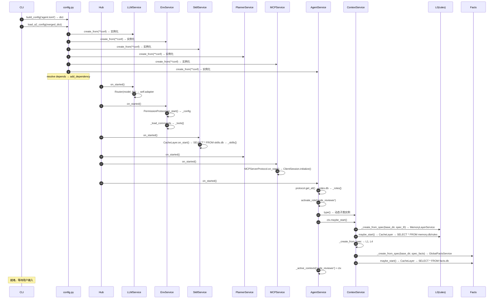

---

## P0-2. S01 直答（无工具）

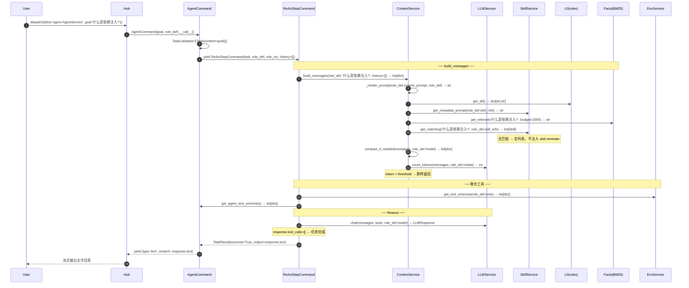

---

## P0-3. S02 单工具调用

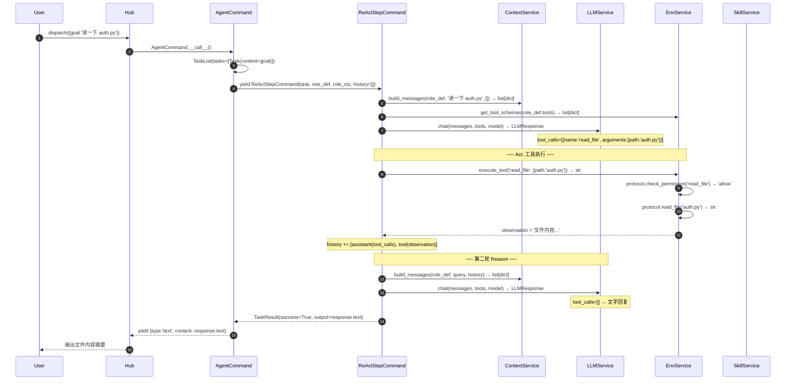

---

## P0-4. S03 多轮工具 + 分析

> S03 与 S02 结构相同，区别在于 LLM 可能连续调用多个工具（读文件 → grep → 分析）。
> 此处只画与 S02 的差异部分：ReAct 循环内多次工具调用。

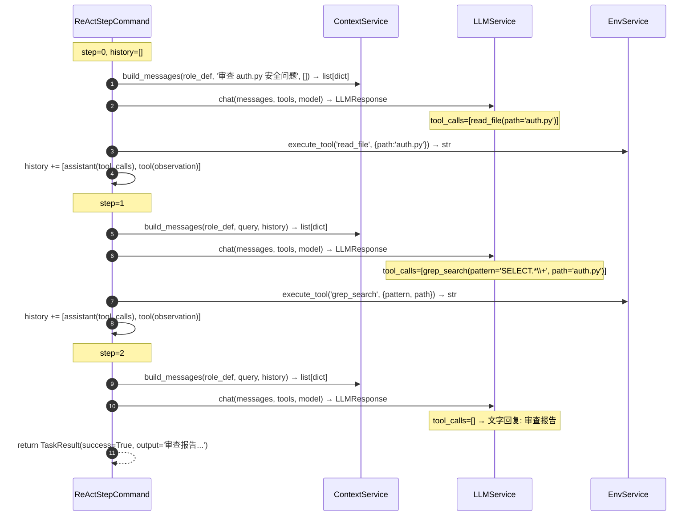

---

## P1-1. S04 任务规划 + 逐步执行

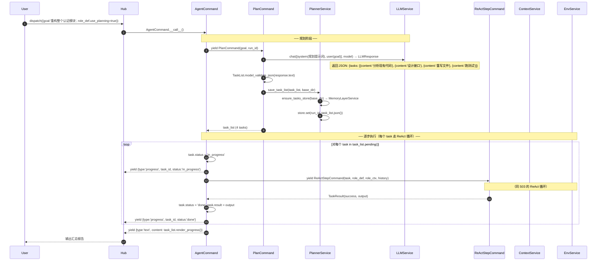

---

## P1-2. S05 多角色并行

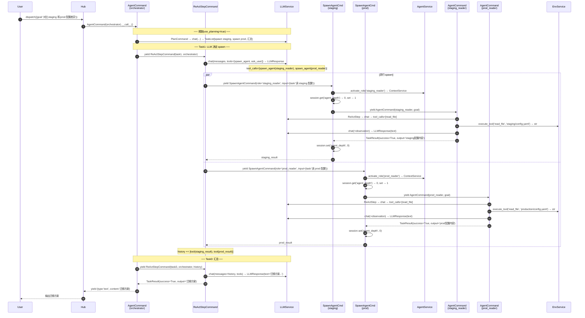

---

## P1-3. S06 子角色失败回退

> 在 S05 基础上，prod_reader 执行失败的分支。

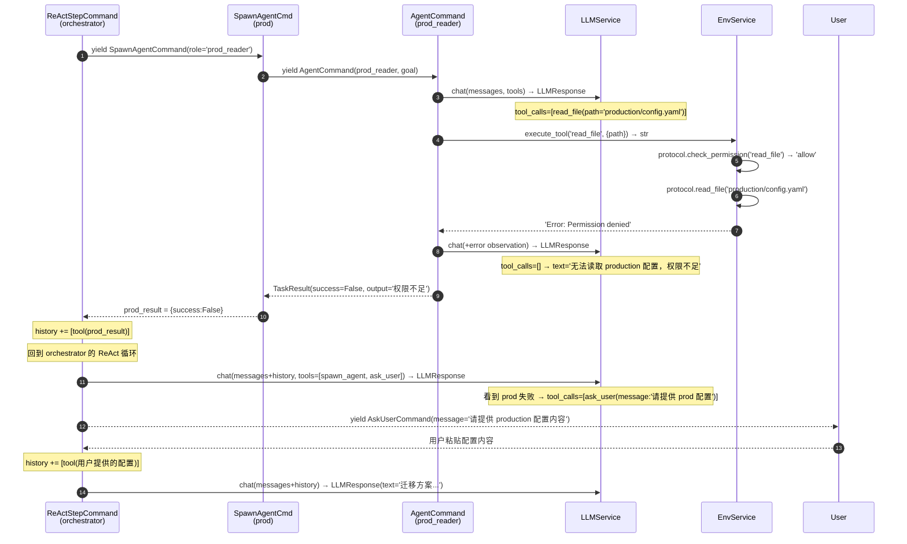

---

## P1-4. S07 危险操作审批

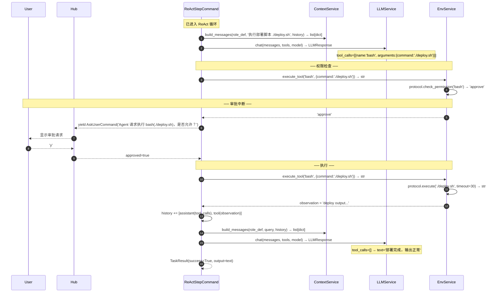

---

## P1-5. S08 外部工具（MCP）

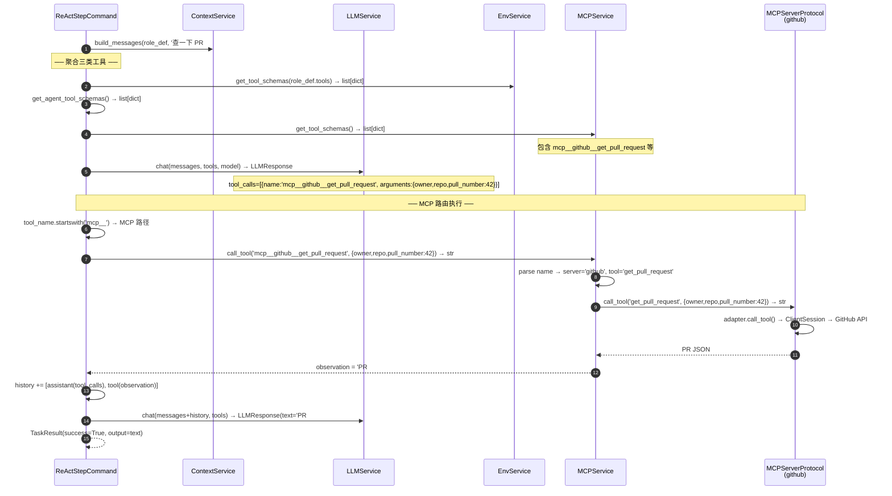

---

## P1-6. S09 权限拒绝

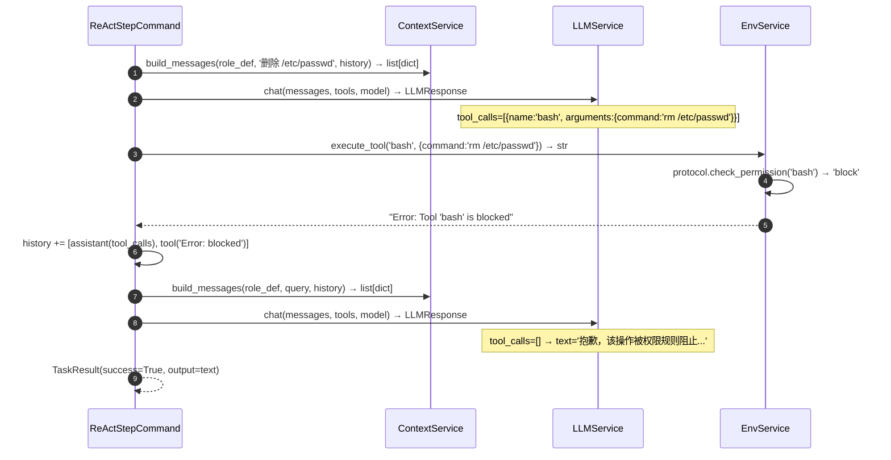

---

## P1-7. S10 长对话自动压缩

> 此图展示 ContextService 内部压缩链路，触发点在 build_messages 中。

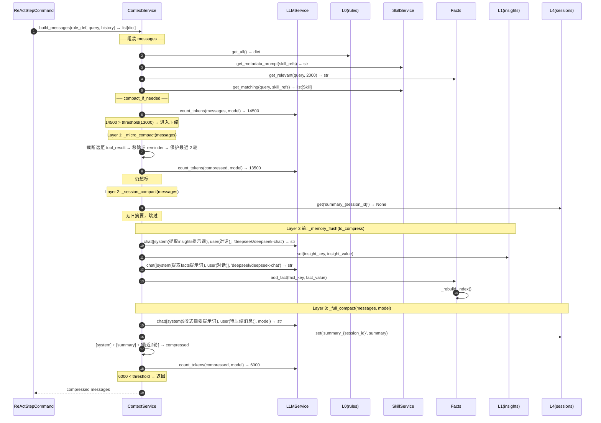

---

## P1-8. S11 跨会话回忆

> S01 的变体：build_messages 时 Facts 检索命中历史信息。

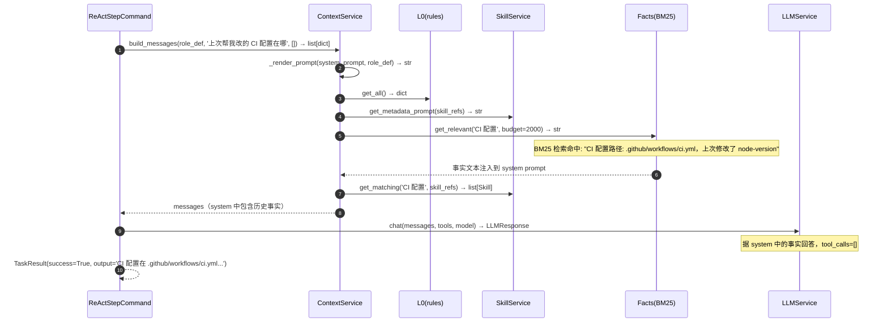

---

## P1-9. S12 技能自动匹配

> S03 的变体：build_messages 时 SkillService 匹配命中，注入 skill reminder。

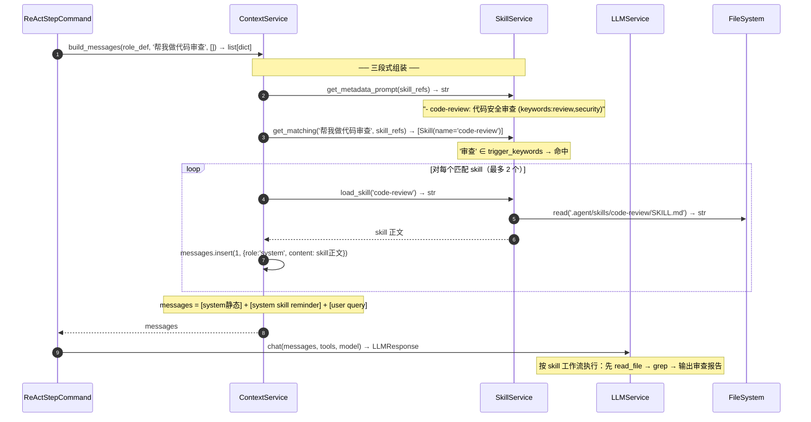

---

## P1-10. S13 手动触发结晶

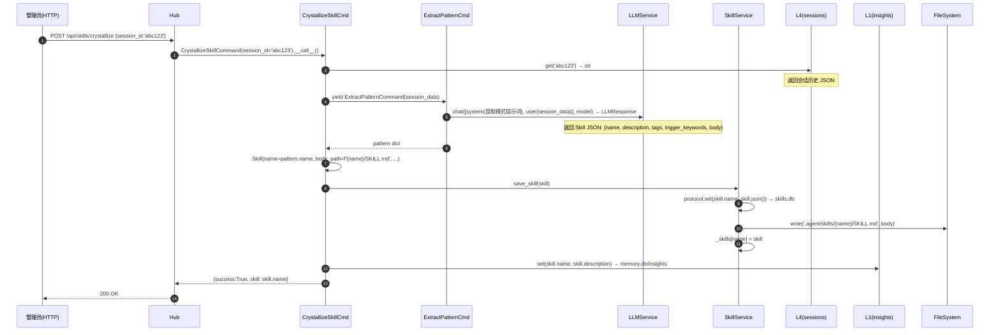

---

## P2-1. S14 角色热更新

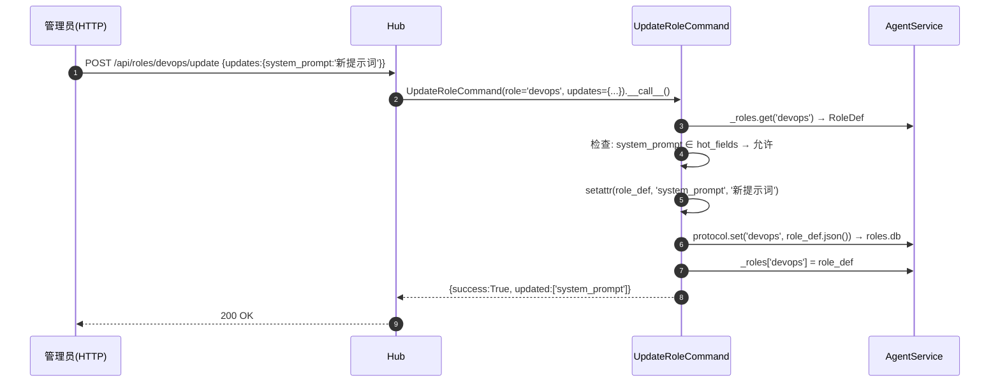

---

## 顺序图 → 接口提取索引

从上述所有箭头中提取的公开方法（步骤 3 的输入）：

| 类 | 方法 | 首次出现 |
|---|------|---------|
| config | `build_config(toml_path) → dict` | S15 |
| config | `load_a2_config(merged) → None` | S15 |
| LLMService | `chat(messages, tools, model, **kw) → LLMResponse` | S01 |
| LLMService | `count_tokens(messages, model) → int` | S01 |
| EnvService | `get_tool_schemas(role_filter) → list[dict]` | S01 |
| EnvService | `execute_tool(name, params) → str` | S02 |
| TerminalProtocol | `check_permission(tool_name) → str` | S02 |
| TerminalProtocol | `read_file(path) → str` | S02 |
| TerminalProtocol | `execute(command, timeout) → str` | S07 |
| SkillService | `get_metadata_prompt(skill_refs) → str` | S01 |
| SkillService | `get_matching(query, skill_refs) → list[Skill]` | S01 |
| SkillService | `load_skill(name) → str` | S12 |
| SkillService | `save_skill(skill) → None` | S13 |
| PlannerService | `save_task_list(task_list, base_dir) → None` | S04 |
| PlannerService | `ensure_tasks_store(base_dir) → MemoryLayerService` | S04 |
| ContextService | `build_messages(role_def, query, history) → list[dict]` | S01 |
| ContextService | `compact_if_needed(messages, model) → list[dict]` | S01 |
| ContextService | `_render_prompt(template, role_def) → str` | S01 |
| ContextService | `_micro_compact(messages) → list[dict]` | S10 |
| ContextService | `_session_compact(messages) → list[dict]` | S10 |
| ContextService | `_memory_flush(messages) → None` | S10 |
| ContextService | `_full_compact(messages, model) → list[dict]` | S10 |
| MCPService | `get_tool_schemas() → list[dict]` | S08 |
| MCPService | `call_tool(full_name, arguments) → str` | S08 |
| MCPServerProtocol | `call_tool(name, arguments) → str` | S08 |
| AgentService | `activate_role(role_name) → ContextService` | S15 |
| AgentService | `get_agent_tool_schemas() → list[dict]` | S01 |
| AgentService | `get_available_description() → str` | S05 |
| MemoryLayerService | `get(key) → str?` | S10 |
| MemoryLayerService | `set(key, value) → None` | S10 |
| MemoryLayerService | `get_all() → dict[str,str]` | S01 |
| GlobalFactsService | `get_relevant(query, budget) → str` | S01 |
| GlobalFactsService | `add_fact(key, value) → None` | S10 |

**缺失类型（需要在步骤 3 中定义）**：

| 类型 | 属性 | 首次出现 |
|------|------|---------|
| `LLMResponse` | text: str, tool_calls: list[ToolCall], usage: dict | S01 |
| `ToolCall` | id: str, name: str, arguments: dict | S02 |
| `TaskResult` | success: bool, output: str | S01 |
| yield chunk | type: str, content/task_id/status | S01 |
